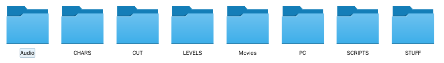
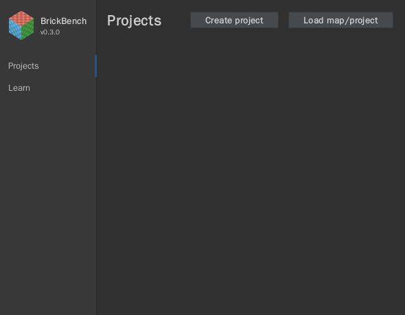
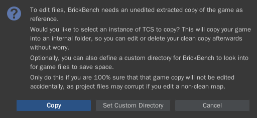

Setup
#####

Prerequisities
**************

To begin editing map files for Lego Star Wars: The Complete Saga, you must have an extracted copy 
of the game. If there isn't one yet, please follow `this`_ tutorial. If the extraction went properly,
your game directory should contain the following folders: 

Once you have these folders, delete the ``.dat`` files in the game directory so the game uses your
mods instead of the base game files.

.. warning::
   It is crucial that you have a **clean** extracted install prior to using BrickBench. 
   BrickBench uses existing game files to compress project files considerably, but using
   an edited copy of the game as an install can permanently corrupt your files and make them
   unusable by anyone else. If you are unsure if your copy is clean, re-extract a copy for
   BrickBench to use. Later on you'll have the chance to delete your new clean copy
   if you want to save space.

.. _this: https://www.youtube.com/watch?v=_EQ3hPrh0V8

Installation
************

To find the most recent releases, go to the BrickBench GitHub `releases`_ page (currently v0.3.0).

.. _releases: https://github.com/BrickBench/BrickBench/releases

There are two ways of installing BrickBench on Windows:

Installer (recommended)
-----------------------

To download the installer version, download ``BrickBench-v0.3.0.msi`` from the most recent
Github release.
Once installed, you should be able to run it through a shortcut or as a normal Windows program.

.. note::
   If you install BrickBench this way, you will be able to double-click .brickbench files to 
   automatically open them through Windows.

   **Advanced**: BrickBench can also be run on the command line with ``brickbench.exe``. 
   If you pass in a folder or project as an argument, BrickBench will automatically open it.

Manual
------

If you do not want to install BrickBench or do not have administrator permissions, you can download the
packaged version. To do so, find the most recent release and download ``BrickBench-v0.3.0.zip``.

Once downloaded, unzip it into a directory of your choice. In the install directory, you should find ``BrickBench.exe``. 

Starting BrickBench
***************************

When you run BrickBench, you will be greeted by the following window:

Once started, you have two options: open an existing map to view, or create a project to
edit maps.

Viewing maps
*************

To begin exploring existing maps, select the 'Load map/project' button on the Projects tab.
Afterwards, select a map folder or a scene (.gsc) file to open it in BrickBench. 

After opening, you will notice that the titlebar of BrickBench says Read-only. This means that
you are currently viewing a map and cannot edit it. if you would like to edit the map, please
create a project and add the map to it.

Creating your first project
***************************
To create a new project, click the 'Create Project' button. BrickBench will ask you for a 
project name (choose whatever you want) and a folder to put the project file into. Once 
saved, your file will be named ``<name>.brickbench``. 

Adding maps
-----------

At the moment, your project is empty. Let's change that. 

To add a new map to your project, go to File -> Import Map/Level and select a map or a level.
This can be done by selecting the directory that contains the map/level you want to add (for example, 
selecting ``Levels/Episode_I/Negotiations`` to add the Negotiations level).

.. note::
   The difference between a map and a level might seem confusing at first, so here's what each one
   means.

   **Map**: a single play area consisting of a scene file and other optional files. An example would
   be Negotiations_A. A map is normally part of a level or area, but can also be independent, such
   as the legal screens.

   **Level/Area**: a collection of maps that are connected in some way through doors and share
   characters, AI state, and certain other properties. An example would be Negotiations, which contains
   Negotiations_A, B, C, Intro, and Outro as maps.

If this is the first time you open a map/level, you will see the following prompt:

There are two options:

* Copy: This option copies the game directory you select into an internal BrickBench folder, after
  which you can delete the directory you selected if you want. This option is highly 
  recommended, as it ensures that there are no accidental changes to your files that may corrupt or prevent loading
  of projects
* Set Custom Directory: This option sets a custom directory that BrickBench will use as a clean copy. This is useful
  if you do not have enough space on your main drive.

We *highly* recommend that you allow BrickBench to make a copy of your files. If you make a project using a modded
base directory, your project may be corrupted **unrecoverably**.

Once you have your map in, :ref:`time to edit <edit-start>`!
