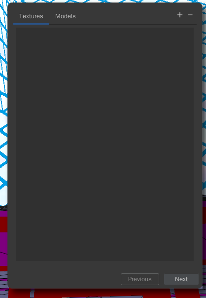

Project
########

BrickBench projects are a collection of maps, levels, and resources, and are the primary way
to use BrickBench.

Project Structure
==================

BrickBench projects have a set of entities that they manage in what is referred to as a 
*project structure*. This structure can be seen in the Project Structure tool. It represents
the export structure of a project, and is meant to match that of the game in most cases to
allow for better compatibility with other mods.

These entities can be edited by selecting them in the Project Structure tool, which will
open them in the Inspector.

The project structure consists of the following objects:

Maps
----

A map in BrickBench refers to a single play space, consisting of a scene file (.gsc)
and accompanying files of the same name. They can be contained within an area, in which
case the map will be named <area name>_<map ID>, or they can be separate from an area as a 
loose scene file (as in the legal screens).

Valid map IDs for compatibility are:

* A,B,C,...: These are meant to be used for normal user-playable maps.

* Intro, Outro, Midtro: These are used for cutscene maps.

Maps are exported into either the directory they're in if they're a loose scene file, or
under the area directory if they're part of an area (eg. if the Negotiations area is in
``Levels/Episode_I/Negotiations``, the Negotiations_A map will be in 
``Levels/Episode_I/Negotiations/Negotiations_A``).

.. note:: 
   BrickBench allows the user to manage maps separately from areas even if the map belongs
   to an area. We recommend against this in most cases, as this will prevent you from adding
   AI characters properly as that information is stored as part of the area, not the map.

Areas
-------
Areas are a collection of maps that share some properties, such as AI state. Their properties
are defined in the *level TXT*, which is the .txt file in the directory the level is in (so
``Negotiations.txt`` in the ``Negotiations`` folder), and in the ``AREAS.TXT`` file, which
is in the ``Levels`` folder.

.. _resources:
Resources
----------

Resources are any files or folders that may be of use for a map or area to work properly.
Some examples are music (.ogg), custom ENGLISH.TXT files, and characters. These can be
added to the project structure and will be exported along with the project.

.. note:: BrickBench **CANNOT** edit these files, and no support for editing non-map files
   is planned. Resources are meant to be used solely as a convenient method of packing 
   files in with your project.

.. _assets:
Assets
==========

Projects also store a number of *assets*, which are models/textures that can be used in maps.
They are stored separately from maps to allow for easy reuse of assets in different maps, even
if you are editing someone else's project and do not have the assets on your computer.

Assets can be imported through the Asset Import window, which can be selected by clicking
Import -> Import Asset in the menubar. 

Click the + button to add a new asset. Assets can be either textures (.dds) or models.
BrickBench currently supports .obj and .fbx models. To import these assets into your map,
see :ref:`here <assets-import>`.

Exporting
==========

Map exporting is done through the Export menu under File->Export. Projects can be exported
either as individual maps or as a whole project, in which case each project entity will
be exported as per the project structure.

If exporting as a map, there are some additional auxiliary files that you may want to
export to allow your project to load properly. These files are the ``LEVELS.TXT`` and 
``AREAS.TXT`` files, which define what maps and areas are loaded and how. There
are three different export methods for these files:

* None: These files will not be exported.
* Stub: These files will be exported, but only containing any changes from the original
  files. They will be exported as <file name>_<project name>.TXT (eg. LEVELS_MyProject.TXT).
  This is the recommended export method for distributing mods, as it allows the user to
  more easily merge your mods into their game.
* Full: These files will be exported in their entirety, including both the original contents
  and your modded contents. This makes it easier to test your project (although we recommend
  that you test your project :ref:`like this <testing>`). However, please do not distribute
  your mods like this, as it makes it much more complicated to merge two different
  mods together.
